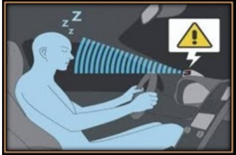
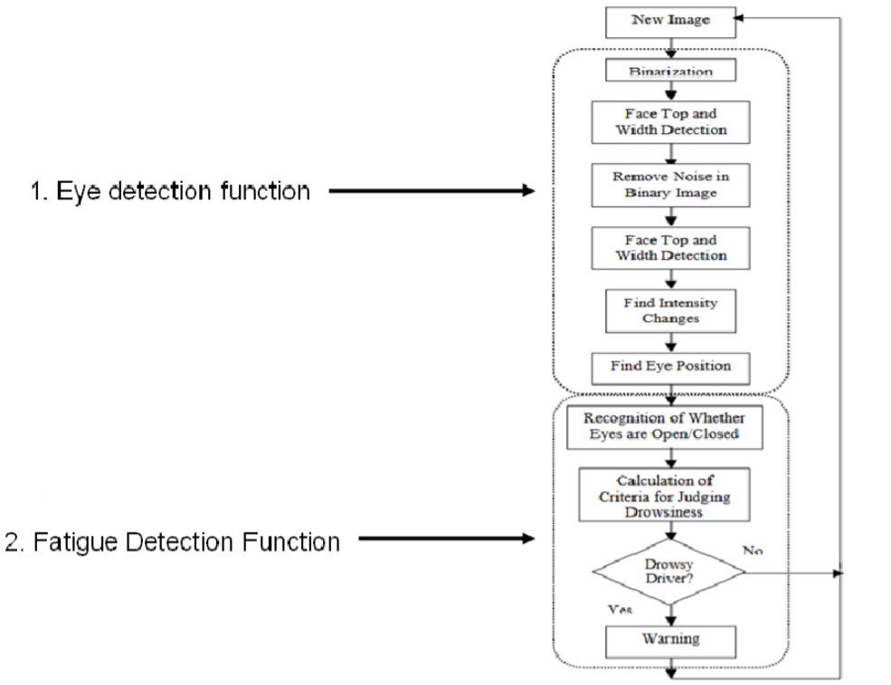
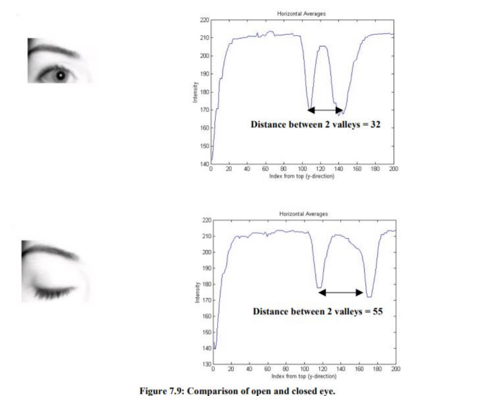

# Driver_Fatigue_Detection
It detects the fatigue symptoms in drivers by their continuous eye movements and alerts the driver if they are feeling fatigue and sleepy.Using OpenCv and other facial feature detection models (in ML) the eyelids movements are tracked in real time in dash-cam and drivers are alerted.

